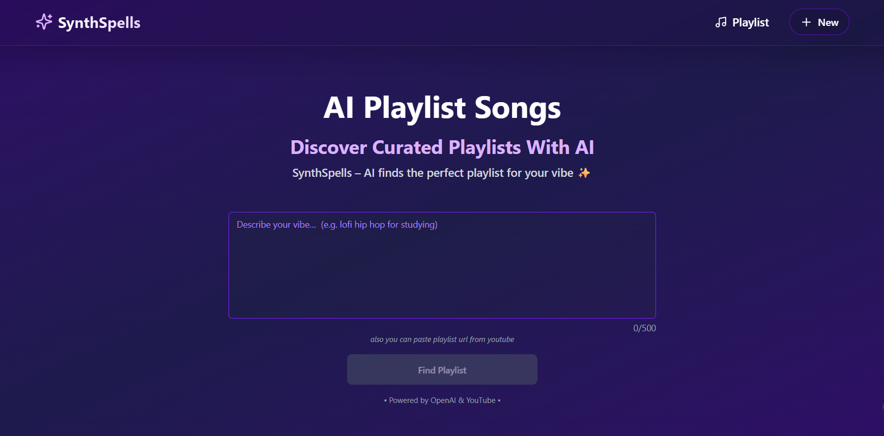

# 🎶 SynthSpells

**AI-powered playlist summoner** — Prompt เพื่อค้นหาเพลย์ลิสต์จาก YouTube ผ่าน AI



## 🔗 Demo
https://synthspells.vercel.app/

## What is SynthSpells?

SynthSpells เป็นเว็บแอปที่ให้คุณ “สร้างเพลย์ลิสต์” ได้จากอารมณ์หรือสถานการณ์ เช่น

> *"chill song for studying"*  

1. **ChatGPT** แปลงข้อความนี้ให้กลายเป็น **ชื่อเพลย์ลิสต์** ที่น่าจะมีอยู่บน YouTube (เช่น `lofi chill cafe playlist`)
2. ใช้ **YouTube API** ค้นหา playlist นั้น
3. list รายการเพลงจาก playlist พร้อมเล่นได้ทันที

## 🧱 Tech Stack

- **Tools**: Next.js + TypeScript + Tailwind CSS
- **AI**: OpenAI ChatGPT  
- **Music API**: YouTube Data API
- **Hosting**: Vercel

## 🚀 Getting Started

**Create `.env.local` file**

```env
OPENAI_API_KEY=your_openai_key
YOUTUBE_API_KEY=your_youtube_key
```

```bash
git clone https://github.com/Patipat003/synthspells
cd synthspells
npm install
npm run dev
```
